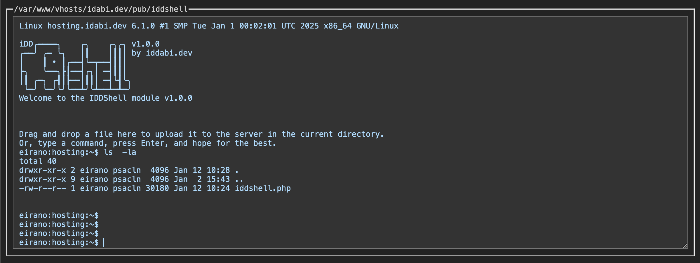

# PHP Web Terminal: Single-File PHP Shell for Administrators

> **WARNING**: This script poses a significant security risk. Use only in trusted environments with proper security measures.

This lightweight, single-file PHP shell provides a web-based terminal interface, enabling users to execute shell commands on the server directly through a browser.

---

## Description

### Terminal

**IDDShell** is a lightweight web-based interface resembling an xterm terminal, allowing execution of shell commands that do not require user interaction (non-interactive).

Similar to a traditional terminal, IDDShell supports tasks such as:

- Changing file permissions
- Viewing network connections
- Checking current processes

**Additional Features:**
- **Uploading and downloading files directly through the terminal interface**

> **Important:** Improper use of IDDShell can compromise server security or stability. Avoid executing unfamiliar commands unless necessary.

### Compatibility

- **Operating Systems**: Unix-like servers only. Not compatible with Microsoft Windows.
- **Hosting Environments**: Requires PHP functions like `exec` and `shell_exec`. Ensure these functions are enabled on your server.
- **PHP Version**: Compatible with PHP 7.2 and above.

---

### Features

- **Command History Navigation**: Use arrow keys (↑ ↓) to navigate through command history and execute previous commands using !<number>.
- **Auto-completion**: Command and file name completion with the Tab key.
- **Remote File System Navigation**: Navigate directories using the `cd` command.
- **File Uploads**: Drag-and-drop files to upload to the server.
- **File Downloads**: Download files using the `download <file_name>` command.
- **Command Validation**: Ensures only allowed commands (defined in `$allowed_commands`) are executed.
- **Session Management**: Tracks the current working directory and supports GODMODE for unrestricted commands.
- **Special Commands**:
    - `iddsessionvars`: Show session variables.
    - `iddsessiondrop`: Resets the current session.
    - `idd**`: Toggles GODMODE for unrestricted execution (will be defined in settings area).
    - `idd*****`: Deletes the script from the server (will be defined in settings area).
    - `download <file_path>`: Downloads the specified file to the client.
- **Minimal Interface**: Simple HTML interface styled like a terminal.
- **Command Recall**: Recall and execute previous commands using `!<number>`.
- **Security Measures**: Limits executable commands in normal mode and sanitizes input to mitigate risks.

### Important Notes

- This script is designed for administrative tasks and should only be used in secure, trusted environments.
- The single-file implementation simplifies deployment but increases security risks if exposed to unauthorized users, particularly with GODMODE enabled.

### TODO (Planned Next Update)
- Add functionality for `Ctrl+C` to interrupt commands.
- Define an array of allowed file types for upload.
- Fix issue where inserting large text/HTML causes a crash.

## Changelog

### 1.0.0 (07.01.2025)
- **File Management:**
  - Added file existence check and unique filename generation during uploads.
  - Enhanced file download logic to support spaces and various MIME types.
  - Improved backend responses for binary and image files.

- **Command History:**
  - Introduced a session-based command history buffer.
  - Added `history` command for server-side history retrieval.
  - Improved frontend navigation for recalling commands.

- **General Improvements:**
  - Updated autocomplete functionality.
  - Enhanced JSON response handling for commands and downloads.

### 0.3.5
- Code refactoring and optimizations.

### 0.3.4
- Added auto-completion with Tab key.
- Enhanced drag-and-drop styling for file uploads.

### 0.3.1
- Introduced file upload functionality.
- Added `sendRequest()` JavaScript method.
- Initialized the TAB method for auto-completion.

### 0.2
- Enabled file downloads.
- Fixed input lag issues.

### 0.1
- Initial release.